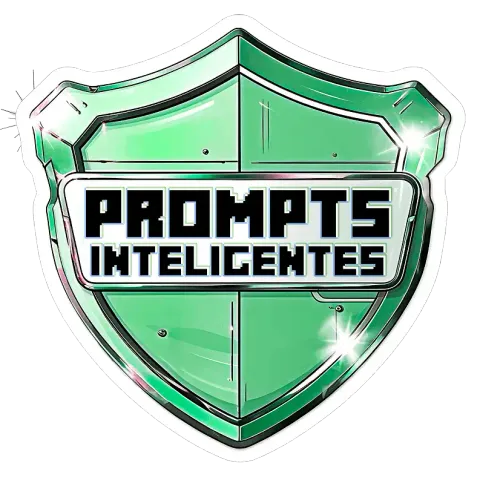

+ao+meu+repositório+da+Microsoft+50+Anos+-+Prompts+Inteligentes!>)

 

 

---

> #### 🎓 Sobre o Bootcamp

- Este bootcamp, oferece uma jornada completa para aprender a transformar IA em trabalhos do dia a dia!
- Guia prático para escrever prompts que geram resultados eficientes com as melhores práticas, regras, técnicas e estruturas de escrita para extrair o máximo possível das ferramentas de IA da Microsoft.
- Com conteúdo mais rápido e direto ao ponto, aprendi e me aprofundei nos principais conceitos das ferramentas de IA para ganhar velocidade e performance nas aplicações com inteligência artificial.

---

> #### 🎯 Objetivo do Bootcamp

- Gerar um podcast utilizando ferramentas de IA através de prompts mais trabalhosos.
- Utilizando uma esteira de prompts para gerar cada etapa do processo criativo

---

> #### 🛠️ Ferramentas Utilizadas

- Microsoft Copilot 🤖
- Gemini 🤖
- ChatGPT 🤖
- Google Drive
- Microsoft Clipchamp
- <a href="https://elevenlabs.io/">Elevenlabs.io/</a>
- <a href="https://aiapp-pt.vidnoz.com/">Vidnoz.io/</a>
- <a href="https://www.freeconvert.com">freeconvert/</a>
- VSCode

---

> #### 👩🏽‍🎨 Como foi criado?

- Roteiro adaptado do Chatgpt e Copilot
- Áudio gerado pela ElevenLabs
- Copilot e Gemini para gerar as capas
- Microsoft Clipchamp para gerar o vídeo, criar a animação do coração no robozinho e as músicas de fundo.
- Freeconvert para compactar o vídeo
- Google Drive para fazer o upload do vídeo

---

> #### 🚶🏽‍♀️ Passo-a-passo do projeto

<strong> Prompts que utilizei:</strong>

1. Passo – criação do título:
   Me ajude a criar um título poderoso para o meu podcast, com o K&D no título.
   O título tem que ser jovial, direto, alegre e com humor.
   O tema de podcast vai variar entre:
   • falar sobre tecnologias;
   • sobre a dificuldade que os iniciantes têm em aprender uma linguagem sozinho(a);
   • falar direto ao ponto sobre macetes do Excel e do Windows;
   • falar sobre como buscar cursos gratuitos de forma bem didática. Quero um tema que seja atrativo, jovial e que desburocratize o tema tecnologia, para que o ouvinte se sinta à vontade e se identifique com o podcast.
   A IA trouxe 10 títulos, mas, para que pudesse saber se existia algum título já utilizado fiz essa seguinte pesquisa:
   Existe algum podcast ou algum site com os nomes citados?
   A IA trouxe vários podcasts existentes, mas, acabei criando o meu título e slogan por conta própria sem ajuda da IA.

2. Passo – criação do slogan:
   Como continuei na mesma conversa, continuei no mesmo contexto, então, não tive dificuldade de pedir um slogan voltado a esse tema.
   Novamente, a IA trouxe uns temas que não me agradaram muito e acabei criando o próprio sem ajuda da IA.

3. Passo – criação da capa do podcast:
   Utilizei o texto do Felipão:

- `Crie um personagem cavaleiro como podcaster, medieval, com microfone estilo retrô, cubo isométrico, estilo jogo nas cores de game boy, 8 bits, sprites retrô, tamanho 1:1.`
  - Mas, não gostei do resultado que as IA’s que utilizei trouxeram, então, desenvolvi o meu próprio prompt.
- `Crie um personagem de um robozinho como podcaster popstar com microfone.`
  - O tamanho da imagem deve ser 1:1.
  - O robozinho deve ser simpático com um leve sorriso e ter um coração no centro do seu peito.
  - O robozinho tem que parecer estar num estúdio de gravação.
- Depois acrescentei o texto abaixo:
  `Agora coloque o robozinho sentado.`
- Mais outro toque especial:
  - `Coloque o texto K&D na imagem.`

4. Passo – criação do roteiro do podcast:

- Você é um roteirista de podcast, e vamos criar um roteiro de um podcast de tecnologia, focado em desmistificar tudo sobre tecnologias, no que tange as dificuldades que os iniciantes têm em aprender uma linguagem sozinho(a), explorando também macetes do Excel e do Windows direto ao ponto sem enrolação e cybersegurança em geral.
  O nome do podcast nome é “K&D ITTI - Informa Tudo sobre TI” e tem foco em dados e cybersegurança, com o público alvo em iniciantes e quem está em transição de carreira.
  o formato do roteiro deve ser:
  - `[INTRODUÇÃO]`
  - `[CURIOSIDADE 1]`
  - `[CURIOSIDADE 2]`
  - `[FINALIZAÇÃO]`

{REGRAS}

- No bloco [INTRODUÇÃO] Substitua por uma introdução iguais às introduções dos vídeos do canal 'ei nerd', como se fossem escritos pelo Peter Jordan
- No bloco [CURIOSIDADE 1] Substitua por uma curiosidade de macetes de Excel e Windows.
- No bloco [CURIOSIDADE 2] Substitua por uma curiosidade de cybersegurança.
- No bloco [FINALIZAÇÃO] Substituição por uma despedida com o final 'Esse foi o K&D ITTI, Informa Tudo sobre TI e terminamos o podcast com esse BANG! Te aguardo na próxima!'
- Use termos de fácil explicação
- O podcast será apresentado somente por uma pessoa, chamada Angélica Kadja.
- O podcast deve ser curto.

{REGRAS NEGATIVAS}

- Não use muitos termos técnicos.
- Não ultrapasse 5 minutos de duração.

---

> #### 👩🏽‍🎨 Trabalho final

- <a href="https://drive.google.com/file/d/1K0TerBjiFc20mnzhwk_z_st_Pc5v08eD/view?usp=sharing">Clique aqui e confira!/</a>

---

 
Feito com , até mais!

👧🏽 - ver mais em <a href="https://github.com/angelicakadja">AK</a>.

