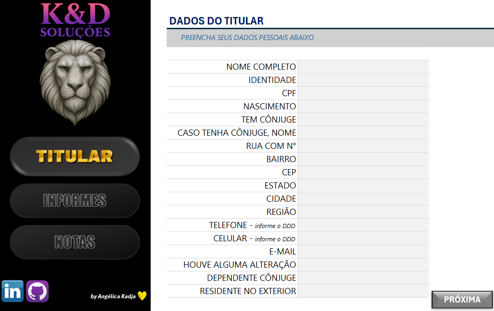
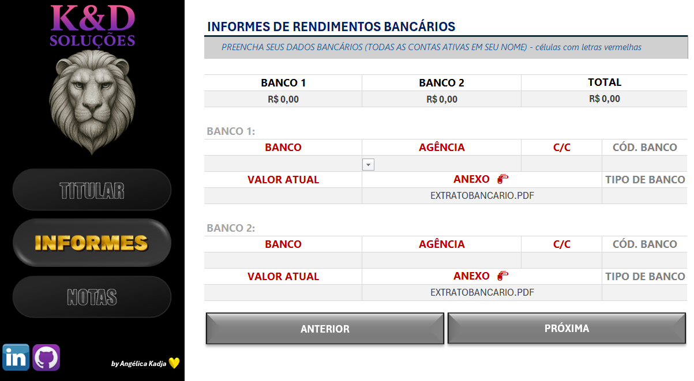
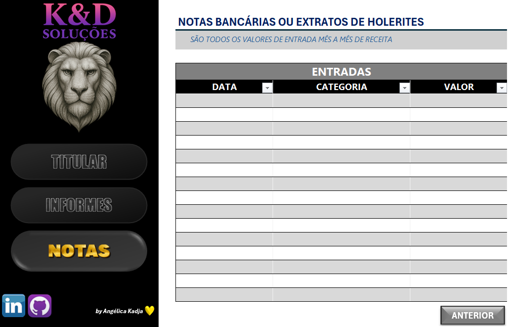

### <i> Criando Um Organizador de Declaração de Imposto de Renda com Excel. </i>

  

 

> #### 🎯 OBJETIVO DO PROJETO

- Desenvolver uma ferramenta no Excel para auxiliar no processo de declaração do imposto de renda.
- A planilha organiza e centraliza as informações financeiras do usuário, garantindo controle eficiente, validações automáticas e usabilidade intuitiva.

---

> #### 📝 ETAPAS DO PROJETO

- 📚 Etapa 1: Fundamentação Teórica.
- 📊 Etapa 2: Planejamento da Ferramenta.
- 📈 Etapa 3: Construção da planilha em Excel.
- 🎯 Etapa 4: Validação e Finalização.

---

> #### ✅ PONTOS ACRESCENTADOS NO PROJETO

- <b>Tema do projeto e logo personalizada </b> - Imagens criadas com a IA Copilot e a paleta utilizada foi cinza azulado.

- <b>Fórmulas especiais </b> – Utilizei fórmulas como PROCV para buscar o código do banco e se ele é público, privado, banco e ou sociedade, além da fórmula `SE(ÉCÉL.VAZIA.(cél))` para que ao ficar vazia, não apareça a mensagem `#N/D`.

- <b>Ocultei guias e barras de rolagem </b> – Lá em Arquivo --> Opções é possível ocultar as guias e as barras de rolagem horizontal e vertical.

- <b>Senha na planilha </b> – As células que tem fórmulas especiais ocultei e bloqueei a planilha contra edição, para que o usuário não fique alterando coisas que não deveriam.

---

> #### 📝 PROJETO FINAL

1. Aba Titular

     

2. Aba Informes

     

3. Aba Notas

       

---

> #### 🛠️ FERRAMENTAS UTILIZADAS

- Microsoft Excel 365
- VSCode
- Git
- GitHub

---

> #### 🧩 TIPO DE DESAFIO

- Excel básico.

---

> #### 🏆 Créditos

  - ver mais em <a href="https://github.com/angelicakadja">AK</a>.

