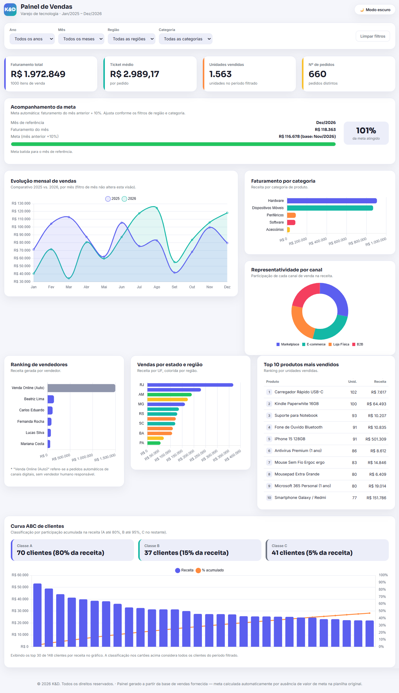

+ao+meu+repositório+para+projetos+de+Excel+com+Claude!>)

 

---

> #### 🎓 Sobre o Desafio!

> Criei um painel de vendas interativo capaz de extrair *insights* e responder a perguntas complexas de negócio nas seguintes frentes:
> * **Performance Financeira e Receita**
> * **Análise de Canais e Vendedores**
> * **Mix de Produtos e Marcas**
> * **Inteligência Geográfica**
> * **Comportamento do Cliente e Pagamentos**
> * **Operações e Eficiência Logística**  
> ⚠️ **Limitações e Regras de Negócio:** 
> Atualmente, não é possível gerar análises sobre **Lucro**, pois, a base de dados que criei não contempla a coluna de *custo de produto*.   Da mesma forma, a ausência da coluna de *estoque* impede a obtenção de *insights* relacionados ao ponto de reabastecimento ou giro de inventário.
  

---

> #### 🎯 Principais Tópicos Abordados

1. Introdução a IAs
2. Tabelas e Análise de Dados
3. Fórmulas Aplicadas no Excel
4. Criando Dashboards com Excel
5. AI Reports com Excel, GPT Agents e Claude Code

> #### 🛠️ FERRAMENTAS UTILIZADAS

- Microsoft Copilot 🤖
- Gemini 🤖
- ChatGPT 🤖
- Microsoft Excel 365 📊
- VSCode 💻
- Git 🌿
- GitHub 🐙

---

> #### 🔊 PROJETO FINAL

- O desafio proposto pela DIO era criar um dashboard de carros da Porsche, mas decidi pivotar o foco para uma área que me fascina: vendas de produtos eletrônicos.
- Para testar os limites e a criatividade de diferentes ferramentas, desenvolvi o projeto utilizando duas IAs distintas:
    > GPT: Criei duas versões do arquivo, sendo uma de tema único e outra com alternância entre modo claro e escuro.
    > Claude: O projeto já nasceu integrado com as duas opções de tema (claro e escuro) logo na primeira tentativa.
- Adicionei os direitos autorais (Copyright) em meu nome em ambos os arquivos, reforçando a autoria integral do projeto.
- Embora este seja um MVP (produto mínimo viável) focado no pontapé inicial das atividades, alguns ajustes finos ainda estão pendentes — como a paleta de cores específica para cada modo, centralização e o espaçamento entre os gráficos centrais, que atualmente se sobrepõem levemente.

  

---

 
Feito com , até mais!

👧🏽 - ver mais em <a href="https://github.com/angelicakadja">AK</a>.

